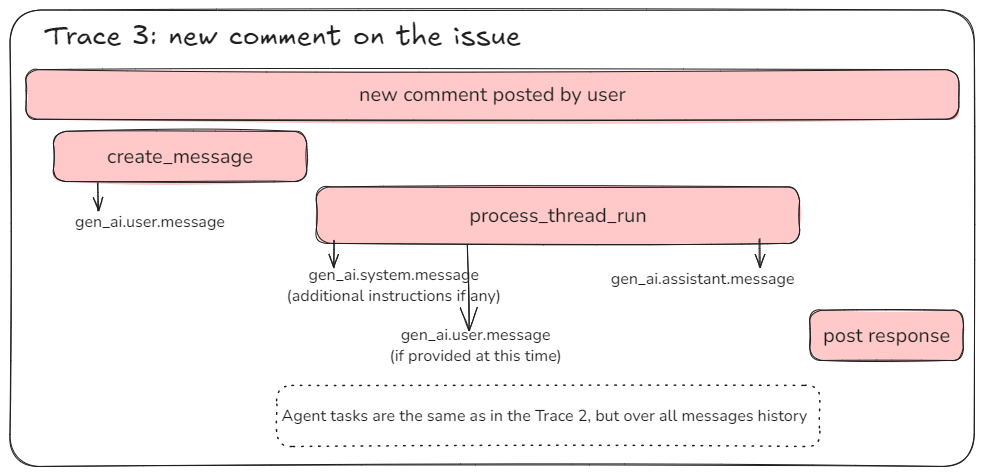
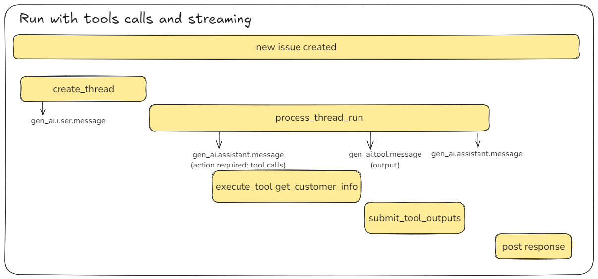
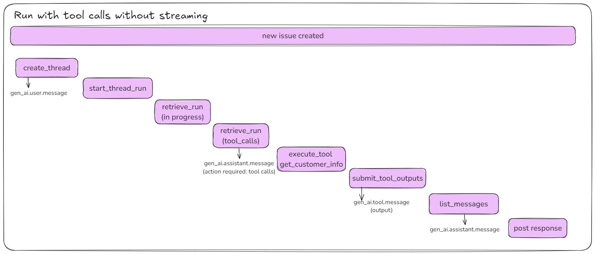

<!--- Hugo front matter used to generate the website version of this page:
linkTitle: Generative AI traces
--->

# Semantic Conventions for GenAI agent and framework spans

**Status**: [Development][DocumentStatus]

<!-- Re-generate TOC with `markdown-toc --no-first-h1 -i` -->

<!-- toc -->

- [Spans](#spans)
  - [Create agent span](#create-agent-span)
  - [Create thread span](#create-thread-span)
  - [Create message span](#create-message-span)
  - [Start thread run span](#start-thread-run-span)
  - [Process thread run span](#process-thread-run-span)
  - [Tool execution span](#tool-execution-span)
  - [Submit tool outputs span](#submit-tool-outputs-span)
- [Examples](#examples)
  - [Backend-side RAG](#backend-side-rag)
  - [GenAI agent with tool calls](#genai-agent-with-tool-calls)
  - [GenAI agent with tool calls without streaming](#genai-agent-with-tool-calls-without-streaming)

<!-- tocstop -->

Generative AI scenarios may involve multiple steps. For example RAG pattern implementation usually involves
the following steps:

- initial request to the GenAI model to rewrite user query
- getting embeddings for the rewritten query
- searching for similar documents in the vector store using embeddings
- getting completion from the GenAI model based on the similar documents.

These steps may be done by the application itself using GenAI models and vector databases.
It's also common to leverage client framework such as [LangGraph](https://github.com/langchain-ai/langgraph)
or service offerings such as [OpenAI Assistants](https://platform.openai.com/docs/assistants),
[Azure AI Agents](TODO link), or [Amazon Bedrock Agents](https://aws.amazon.com/bedrock/agents/).

This document defines semantic conventions for GenAI agent calls that are
handled by the remote agent service.
It MAY be applicable to agent operations that are performed by the GenAI
framework locally.

The semantic conventions for GenAI agents extend and override the semantic conventions
for [Gen AI Spans](gen-ai-spans.md).

## Spans

### Create agent span

Describes GenAI agent creation and is usually applicable when working with remote agent
services.

The `gen_ai.operation.name` SHOULD be `create_agent`.

The **span name** SHOULD be `create_agent {gen_ai.agent.name}`.
Semantic conventions for individual GenAI systems and frameworks MAY specify different span name format.

<!-- semconv span.gen_ai.create_agent.client -->
<!-- NOTE: THIS TEXT IS AUTOGENERATED. DO NOT EDIT BY HAND. -->
<!-- see templates/registry/markdown/snippet.md.j2 -->
<!-- prettier-ignore-start -->
<!-- markdownlint-capture -->
<!-- markdownlint-disable -->

| Attribute  | Type | Description  | Examples  | [Requirement Level](https://opentelemetry.io/docs/specs/semconv/general/attribute-requirement-level/) | Stability |
|---|---|---|---|---|---|
| [`gen_ai.system`](/docs/attributes-registry/gen-ai.md) | string | The Generative AI product as identified by the client or server instrumentation. [1] | `openai` | `Required` |  |
| [`error.type`](/docs/attributes-registry/error.md) | string | Describes a class of error the operation ended with. [2] | `timeout`; `java.net.UnknownHostException`; `server_certificate_invalid`; `500` | `Conditionally Required` if the operation ended in an error |  |
| [`gen_ai.agent.description`](/docs/attributes-registry/gen-ai.md) | string | Free-form description of the GenAI agent provided by the application. | `Helps with math problems`; `Generates fiction stories` | `Conditionally Required` If provided by the application. |  |
| [`gen_ai.agent.id`](/docs/attributes-registry/gen-ai.md) | string | The unique identifier of the GenAI agent. | `asst_5j66UpCpwteGg4YSxUnt7lPY` | `Conditionally Required` if applicable. |  |
| [`gen_ai.agent.name`](/docs/attributes-registry/gen-ai.md) | string | Human-readable name of the GenAI agent provided by the application. | `Math Tutor`; `Fiction Writer` | `Conditionally Required` If provided by the application. |  |
| [`gen_ai.output.type`](/docs/attributes-registry/gen-ai.md) | string | Represents the content type requested by the client. [3] | `text`; `json`; `image` | `Conditionally Required` [4] |  |
| [`gen_ai.request.choice.count`](/docs/attributes-registry/gen-ai.md) | int | The target number of candidate completions to return. | `3` | `Conditionally Required` if available, in the request, and !=1 |  |
| [`gen_ai.request.model`](/docs/attributes-registry/gen-ai.md) | string | The name of the GenAI model a request is being made to. [5] | `gpt-4` | `Conditionally Required` If provided by the application. |  |
| [`gen_ai.request.seed`](/docs/attributes-registry/gen-ai.md) | int | Requests with same seed value more likely to return same result. | `100` | `Conditionally Required` if applicable and if the request includes a seed |  |
| [`gen_ai.request.temperature`](/docs/attributes-registry/gen-ai.md) | double | The temperature setting for the GenAI request. | `0.0` | `Conditionally Required` If provided by the application. |  |
| [`gen_ai.request.top_p`](/docs/attributes-registry/gen-ai.md) | double | The top_p sampling setting for the GenAI request. | `1.0` | `Conditionally Required` If provided by the application. |  |
| [`server.port`](/docs/attributes-registry/server.md) | int | GenAI server port. [6] | `80`; `8080`; `443` | `Conditionally Required` If `server.address` is set. |  |
| [`gen_ai.message.id`](/docs/attributes-registry/gen-ai.md) | string | Identifies message sent to or received from Generative AI model or agent. [7] | `msg_sLMd7grQfjFXgu5ZeHCXmBr7`; `chatcmpl-123` | `Recommended` |  |
| [`gen_ai.request.encoding_formats`](/docs/attributes-registry/gen-ai.md) | string[] | The encoding formats requested in an embeddings operation, if specified. [8] | `["base64"]`; `["float", "binary"]` | `Recommended` |  |
| [`gen_ai.request.frequency_penalty`](/docs/attributes-registry/gen-ai.md) | double | The frequency penalty setting for the GenAI request. | `0.1` | `Recommended` |  |
| [`gen_ai.request.max_input_tokens`](/docs/attributes-registry/gen-ai.md) | int | The maximum number of prompt tokens the model can use. | `100` | `Recommended` |  |
| [`gen_ai.request.max_output_tokens`](/docs/attributes-registry/gen-ai.md) | int | The maximum number of completion tokens the model generates in response. | `100` | `Recommended` |  |
| [`gen_ai.request.presence_penalty`](/docs/attributes-registry/gen-ai.md) | double | The presence penalty setting for the GenAI request. | `0.1` | `Recommended` |  |
| [`gen_ai.request.stop_sequences`](/docs/attributes-registry/gen-ai.md) | string[] | List of sequences that the model will use to stop generating further tokens. | `["forest", "lived"]` | `Recommended` |  |
| [`gen_ai.response.finish_reasons`](/docs/attributes-registry/gen-ai.md) | string[] | Array of reasons the model stopped generating tokens, corresponding to each generation received. | `["stop"]`; `["stop", "length"]` | `Recommended` |  |
| [`gen_ai.response.model`](/docs/attributes-registry/gen-ai.md) | string | The name of the model that generated the response. [9] | `gpt-4-0613` | `Recommended` |  |
| [`gen_ai.usage.input_tokens`](/docs/attributes-registry/gen-ai.md) | int | The number of tokens used in the GenAI input (prompt). | `100` | `Recommended` |  |
| [`gen_ai.usage.output_tokens`](/docs/attributes-registry/gen-ai.md) | int | The number of tokens used in the GenAI response (completion). | `180` | `Recommended` |  |
| [`server.address`](/docs/attributes-registry/server.md) | string | GenAI server address. [10] | `example.com`; `10.1.2.80`; `/tmp/my.sock` | `Recommended` [11] |  |

**[1] `gen_ai.system`:** The `gen_ai.system` describes a family of GenAI models with specific model identified
by `gen_ai.request.model` and `gen_ai.response.model` attributes.

The actual GenAI product may differ from the one identified by the client.
Multiple systems, including Azure OpenAI and Gemini, are accessible by OpenAI client
libraries. In such cases, the `gen_ai.system` is set to `openai` based on the
instrumentation's best knowledge, instead of the actual system. The `server.address`
attribute may help identify the actual system in use for `openai`.

For custom model, a custom friendly name SHOULD be used.
If none of these options apply, the `gen_ai.system` SHOULD be set to `_OTHER`.

**[2] `error.type`:** The `error.type` SHOULD match the error code returned by the Generative AI provider or the client library,
the canonical name of exception that occurred, or another low-cardinality error identifier.
Instrumentations SHOULD document the list of errors they report.

**[3] `gen_ai.output.type`:** This attribute SHOULD be used when the client requests output of a specific type. The model may return zero or more outputs of this type.
This attribute specifies the output modality and not the actual output format. For example, if an image is requested, the actual output could be a URL pointing to an image file.
Additional output format details may be recorded in the future in the `gen_ai.output.{type}.*` attributes.

**[4] `gen_ai.output.type`:** when applicable and if the request includes an output format.

**[5] `gen_ai.request.model`:** The name of the GenAI model a request is being made to. If the model is supplied by a vendor, then the value must be the exact name of the model requested. If the model is a fine-tuned custom model, the value should have a more specific name than the base model that's been fine-tuned.

**[6] `server.port`:** When observed from the client side, and when communicating through an intermediary, `server.port` SHOULD represent the server port behind any intermediaries, for example proxies, if it's available.

**[7] `gen_ai.message.id`:** For inference operations such as `chat` or `text_completion`, it SHOULD be the completion identifier returned by the GenAI system and may not be unique if multiple choices are returned.
If message history is managed by the application, agent, or framework, it SHOULD match the identifier used by the message history management system.

**[8] `gen_ai.request.encoding_formats`:** In some GenAI systems the encoding formats are called embedding types. Also, some GenAI systems only accept a single format per request.

**[9] `gen_ai.response.model`:** If available. The name of the GenAI model that provided the response. If the model is supplied by a vendor, then the value must be the exact name of the model actually used. If the model is a fine-tuned custom model, the value should have a more specific name than the base model that's been fine-tuned.

**[10] `server.address`:** When observed from the client side, and when communicating through an intermediary, `server.address` SHOULD represent the server address behind any intermediaries, for example proxies, if it's available.

**[11] `server.address`:** if available and if operation involves remote calls against GenAI service.

---

`error.type` has the following list of well-known values. If one of them applies, then the respective value MUST be used; otherwise, a custom value MAY be used.

| Value  | Description | Stability |
|---|---|---|
| `_OTHER` | A fallback error value to be used when the instrumentation doesn't define a custom value. |  |

---

`gen_ai.output.type` has the following list of well-known values. If one of them applies, then the respective value MUST be used; otherwise, a custom value MAY be used.

| Value  | Description | Stability |
|---|---|---|
| `image` | Image |  |
| `json` | JSON object with known or unknown schema |  |
| `speech` | Speech |  |
| `text` | Plain text |  |

---

`gen_ai.system` has the following list of well-known values. If one of them applies, then the respective value MUST be used; otherwise, a custom value MAY be used.

| Value  | Description | Stability |
|---|---|---|
| `anthropic` | Anthropic |  |
| `aws.bedrock` | AWS Bedrock |  |
| `az.ai.inference` | Azure AI Inference |  |
| `az.ai.openai` | Azure OpenAI |  |
| `cohere` | Cohere |  |
| `deepseek` | DeepSeek |  |
| `gemini` | Gemini |  |
| `groq` | Groq |  |
| `ibm.watsonx.ai` | IBM Watsonx AI |  |
| `mistral_ai` | Mistral AI |  |
| `openai` | OpenAI |  |
| `perplexity` | Perplexity |  |
| `vertex_ai` | Vertex AI |  |
| `xai` | xAI |  |

<!-- markdownlint-restore -->
<!-- prettier-ignore-end -->
<!-- END AUTOGENERATED TEXT -->
<!-- endsemconv -->

The following events SHOULD be reported as children of this span:

- [`gen_ai.system.message`](./gen-ai-events.md#event-gen_aisystemmessage) - captures
  instructions provided at agent creation time.

### Create thread span

Describes creation of the thread on the GenAI agent and is usually applicable
when working with remote agent services.

The `gen_ai.operation.name` MUST be `create_thread`.

The **span name** SHOULD be `create_thread`.
Semantic conventions for individual GenAI systems and frameworks MAY specify
different span name format.

<!-- semconv span.gen_ai.create_thread.client -->
<!-- NOTE: THIS TEXT IS AUTOGENERATED. DO NOT EDIT BY HAND. -->
<!-- see templates/registry/markdown/snippet.md.j2 -->
<!-- prettier-ignore-start -->
<!-- markdownlint-capture -->
<!-- markdownlint-disable -->

| Attribute  | Type | Description  | Examples  | [Requirement Level](https://opentelemetry.io/docs/specs/semconv/general/attribute-requirement-level/) | Stability |
|---|---|---|---|---|---|
| [`gen_ai.system`](/docs/attributes-registry/gen-ai.md) | string | The Generative AI product as identified by the client or server instrumentation. [1] | `openai` | `Required` |  |
| [`error.type`](/docs/attributes-registry/error.md) | string | Describes a class of error the operation ended with. [2] | `timeout`; `java.net.UnknownHostException`; `server_certificate_invalid`; `500` | `Conditionally Required` if the operation ended in an error |  |
| [`gen_ai.request.model`](/docs/attributes-registry/gen-ai.md) | string | The name of the GenAI model a request is being made to. [3] | `gpt-4` | `Conditionally Required` If available. |  |
| [`gen_ai.thread.id`](/docs/attributes-registry/gen-ai.md) | string | The unique identifier of the thread. | `thread_ggguJ0iZXRPjUnCy9vT9Fdvs` | `Conditionally Required` if available |  |
| [`server.port`](/docs/attributes-registry/server.md) | int | GenAI server port. [4] | `80`; `8080`; `443` | `Conditionally Required` If `server.address` is set. |  |
| [`server.address`](/docs/attributes-registry/server.md) | string | GenAI server address. [5] | `example.com`; `10.1.2.80`; `/tmp/my.sock` | `Recommended` [6] |  |

**[1] `gen_ai.system`:** The `gen_ai.system` describes a family of GenAI models with specific model identified
by `gen_ai.request.model` and `gen_ai.response.model` attributes.

The actual GenAI product may differ from the one identified by the client.
Multiple systems, including Azure OpenAI and Gemini, are accessible by OpenAI client
libraries. In such cases, the `gen_ai.system` is set to `openai` based on the
instrumentation's best knowledge, instead of the actual system. The `server.address`
attribute may help identify the actual system in use for `openai`.

For custom model, a custom friendly name SHOULD be used.
If none of these options apply, the `gen_ai.system` SHOULD be set to `_OTHER`.

**[2] `error.type`:** The `error.type` SHOULD match the error code returned by the Generative AI provider or the client library,
the canonical name of exception that occurred, or another low-cardinality error identifier.
Instrumentations SHOULD document the list of errors they report.

**[3] `gen_ai.request.model`:** The name of the GenAI model a request is being made to. If the model is supplied by a vendor, then the value must be the exact name of the model requested. If the model is a fine-tuned custom model, the value should have a more specific name than the base model that's been fine-tuned.

**[4] `server.port`:** When observed from the client side, and when communicating through an intermediary, `server.port` SHOULD represent the server port behind any intermediaries, for example proxies, if it's available.

**[5] `server.address`:** When observed from the client side, and when communicating through an intermediary, `server.address` SHOULD represent the server address behind any intermediaries, for example proxies, if it's available.

**[6] `server.address`:** if available and if operation involves remote calls against GenAI service.

---

`error.type` has the following list of well-known values. If one of them applies, then the respective value MUST be used; otherwise, a custom value MAY be used.

| Value  | Description | Stability |
|---|---|---|
| `_OTHER` | A fallback error value to be used when the instrumentation doesn't define a custom value. |  |

---

`gen_ai.system` has the following list of well-known values. If one of them applies, then the respective value MUST be used; otherwise, a custom value MAY be used.

| Value  | Description | Stability |
|---|---|---|
| `anthropic` | Anthropic |  |
| `aws.bedrock` | AWS Bedrock |  |
| `az.ai.inference` | Azure AI Inference |  |
| `az.ai.openai` | Azure OpenAI |  |
| `cohere` | Cohere |  |
| `deepseek` | DeepSeek |  |
| `gemini` | Gemini |  |
| `groq` | Groq |  |
| `ibm.watsonx.ai` | IBM Watsonx AI |  |
| `mistral_ai` | Mistral AI |  |
| `openai` | OpenAI |  |
| `perplexity` | Perplexity |  |
| `vertex_ai` | Vertex AI |  |
| `xai` | xAI |  |

<!-- markdownlint-restore -->
<!-- prettier-ignore-end -->
<!-- END AUTOGENERATED TEXT -->
<!-- endsemconv -->

The following events SHOULD be reported as children of this span when corresponding
details are available:

- [`gen_ai.user.message`](./gen-ai-events.md#event-gen_aiusermessage) - captures
  user messages provided at the thread creation time.
- [`gen_ai.assistant.message`](./gen-ai-events.md#event-gen_aiassistantmessage) -
  captures assistant messages provided at the thread creation time.

Instrumentations SHOULD record one `gen_ai.{role}.message` event for each message
provided at thread creation time.

### Create message span

Describes creation of the message on the GenAI agent and is usually applicable when
working with remote agent or history management services.

The `gen_ai.operation.name` MUST be `create_message`.

The **span name** SHOULD be `create_message`.
Semantic conventions for individual GenAI systems and frameworks MAY specify
different span name format.

<!-- semconv span.gen_ai.create_message.client -->
<!-- NOTE: THIS TEXT IS AUTOGENERATED. DO NOT EDIT BY HAND. -->
<!-- see templates/registry/markdown/snippet.md.j2 -->
<!-- prettier-ignore-start -->
<!-- markdownlint-capture -->
<!-- markdownlint-disable -->

| Attribute  | Type | Description  | Examples  | [Requirement Level](https://opentelemetry.io/docs/specs/semconv/general/attribute-requirement-level/) | Stability |
|---|---|---|---|---|---|
| [`gen_ai.system`](/docs/attributes-registry/gen-ai.md) | string | The Generative AI product as identified by the client or server instrumentation. [1] | `openai` | `Required` |  |
| [`error.type`](/docs/attributes-registry/error.md) | string | Describes a class of error the operation ended with. [2] | `timeout`; `java.net.UnknownHostException`; `server_certificate_invalid`; `500` | `Conditionally Required` if the operation ended in an error |  |
| [`gen_ai.message.id`](/docs/attributes-registry/gen-ai.md) | string | Identifies message sent to or received from Generative AI model or agent. [3] | `msg_sLMd7grQfjFXgu5ZeHCXmBr7`; `chatcmpl-123` | `Conditionally Required` if available |  |
| [`gen_ai.request.model`](/docs/attributes-registry/gen-ai.md) | string | The name of the GenAI model a request is being made to. [4] | `gpt-4` | `Conditionally Required` If available. |  |
| [`gen_ai.thread.id`](/docs/attributes-registry/gen-ai.md) | string | The unique identifier of the thread. | `thread_ggguJ0iZXRPjUnCy9vT9Fdvs` | `Conditionally Required` if available |  |
| [`server.port`](/docs/attributes-registry/server.md) | int | GenAI server port. [5] | `80`; `8080`; `443` | `Conditionally Required` If `server.address` is set. |  |
| [`server.address`](/docs/attributes-registry/server.md) | string | GenAI server address. [6] | `example.com`; `10.1.2.80`; `/tmp/my.sock` | `Recommended` [7] |  |

**[1] `gen_ai.system`:** The `gen_ai.system` describes a family of GenAI models with specific model identified
by `gen_ai.request.model` and `gen_ai.response.model` attributes.

The actual GenAI product may differ from the one identified by the client.
Multiple systems, including Azure OpenAI and Gemini, are accessible by OpenAI client
libraries. In such cases, the `gen_ai.system` is set to `openai` based on the
instrumentation's best knowledge, instead of the actual system. The `server.address`
attribute may help identify the actual system in use for `openai`.

For custom model, a custom friendly name SHOULD be used.
If none of these options apply, the `gen_ai.system` SHOULD be set to `_OTHER`.

**[2] `error.type`:** The `error.type` SHOULD match the error code returned by the Generative AI provider or the client library,
the canonical name of exception that occurred, or another low-cardinality error identifier.
Instrumentations SHOULD document the list of errors they report.

**[3] `gen_ai.message.id`:** For inference operations such as `chat` or `text_completion`, it SHOULD be the completion identifier returned by the GenAI system and may not be unique if multiple choices are returned.
If message history is managed by the application, agent, or framework, it SHOULD match the identifier used by the message history management system.

**[4] `gen_ai.request.model`:** The name of the GenAI model a request is being made to. If the model is supplied by a vendor, then the value must be the exact name of the model requested. If the model is a fine-tuned custom model, the value should have a more specific name than the base model that's been fine-tuned.

**[5] `server.port`:** When observed from the client side, and when communicating through an intermediary, `server.port` SHOULD represent the server port behind any intermediaries, for example proxies, if it's available.

**[6] `server.address`:** When observed from the client side, and when communicating through an intermediary, `server.address` SHOULD represent the server address behind any intermediaries, for example proxies, if it's available.

**[7] `server.address`:** if available and if operation involves remote calls against GenAI service.

---

`error.type` has the following list of well-known values. If one of them applies, then the respective value MUST be used; otherwise, a custom value MAY be used.

| Value  | Description | Stability |
|---|---|---|
| `_OTHER` | A fallback error value to be used when the instrumentation doesn't define a custom value. |  |

---

`gen_ai.system` has the following list of well-known values. If one of them applies, then the respective value MUST be used; otherwise, a custom value MAY be used.

| Value  | Description | Stability |
|---|---|---|
| `anthropic` | Anthropic |  |
| `aws.bedrock` | AWS Bedrock |  |
| `az.ai.inference` | Azure AI Inference |  |
| `az.ai.openai` | Azure OpenAI |  |
| `cohere` | Cohere |  |
| `deepseek` | DeepSeek |  |
| `gemini` | Gemini |  |
| `groq` | Groq |  |
| `ibm.watsonx.ai` | IBM Watsonx AI |  |
| `mistral_ai` | Mistral AI |  |
| `openai` | OpenAI |  |
| `perplexity` | Perplexity |  |
| `vertex_ai` | Vertex AI |  |
| `xai` | xAI |  |

<!-- markdownlint-restore -->
<!-- prettier-ignore-end -->
<!-- END AUTOGENERATED TEXT -->
<!-- endsemconv -->

The one of the following events SHOULD be reported as a child of this span:

- [`gen_ai.user.message`](./gen-ai-events.md#event-gen_aiusermessage) - captures
  user messages provided at the thread creation time.
- [`gen_ai.assistant.message`](./gen-ai-events.md#event-gen_aiassistantmessage) -
  captures assistant messages provided at the thread creation time.

### Start thread run span

Describes creation of the thread run on GenAI agent and is usually applicable
when working with remote agents.

The `gen_ai.operation.name` MUST be `start_thread_run`.

The **span name** SHOULD be `start_thread_run`.

Semantic conventions for individual GenAI systems and frameworks MAY specify
different span name format.

This span SHOULD be reported when application is starting a run without awaiting
its completion. It SHOULD NOT be reported when instrumentation can capture the
full run processing. Full processing is covered by the
[Process thread run span](#process-thread-run-span).

<!-- semconv span.gen_ai.start_thread_run.client -->
<!-- NOTE: THIS TEXT IS AUTOGENERATED. DO NOT EDIT BY HAND. -->
<!-- see templates/registry/markdown/snippet.md.j2 -->
<!-- prettier-ignore-start -->
<!-- markdownlint-capture -->
<!-- markdownlint-disable -->

| Attribute  | Type | Description  | Examples  | [Requirement Level](https://opentelemetry.io/docs/specs/semconv/general/attribute-requirement-level/) | Stability |
|---|---|---|---|---|---|
| [`gen_ai.agent.id`](/docs/attributes-registry/gen-ai.md) | string | The unique identifier of the GenAI agent. | `asst_5j66UpCpwteGg4YSxUnt7lPY` | `Required` |  |
| [`gen_ai.system`](/docs/attributes-registry/gen-ai.md) | string | The Generative AI product as identified by the client or server instrumentation. [1] | `openai` | `Required` |  |
| [`gen_ai.thread.id`](/docs/attributes-registry/gen-ai.md) | string | The unique identifier of the thread. | `thread_ggguJ0iZXRPjUnCy9vT9Fdvs` | `Required` |  |
| [`error.type`](/docs/attributes-registry/error.md) | string | Describes a class of error the operation ended with. [2] | `timeout`; `java.net.UnknownHostException`; `server_certificate_invalid`; `500` | `Conditionally Required` if the operation ended in an error |  |
| [`gen_ai.request.max_input_tokens`](/docs/attributes-registry/gen-ai.md) | int | The maximum number of prompt tokens the model can use. | `100` | `Conditionally Required` If provided by the application. |  |
| [`gen_ai.request.max_output_tokens`](/docs/attributes-registry/gen-ai.md) | int | The maximum number of completion tokens the model generates in response. | `100` | `Conditionally Required` If provided by the application. |  |
| [`gen_ai.request.model`](/docs/attributes-registry/gen-ai.md) | string | The name of the GenAI model a request is being made to. [3] | `gpt-4` | `Conditionally Required` If provided by the application. |  |
| [`gen_ai.request.temperature`](/docs/attributes-registry/gen-ai.md) | double | The temperature setting for the GenAI request. | `0.0` | `Conditionally Required` If provided by the application. |  |
| [`gen_ai.request.top_p`](/docs/attributes-registry/gen-ai.md) | double | The top_p sampling setting for the GenAI request. | `1.0` | `Conditionally Required` If provided by the application. |  |
| [`gen_ai.response.model`](/docs/attributes-registry/gen-ai.md) | string | The name of the model that generated the response. | `gpt-4-0613` | `Conditionally Required` If provided by the application. |  |
| [`gen_ai.thread.run.id`](/docs/attributes-registry/gen-ai.md) | string | The unique identifier of the thread run. | `run_ep8IxBKdM06Mv338KNyo6EKP` | `Conditionally Required` if available |  |
| [`gen_ai.thread.run.status`](/docs/attributes-registry/gen-ai.md) | string | The thread run status [4] | `queued`; `in_progress`; `completed` | `Conditionally Required` If run has started. |  |
| [`gen_ai.usage.input_tokens`](/docs/attributes-registry/gen-ai.md) | int | The number of input tokens for the whole run | `100` | `Conditionally Required` If available. |  |
| [`gen_ai.usage.output_tokens`](/docs/attributes-registry/gen-ai.md) | int | The number of output tokens for the whole run | `180` | `Conditionally Required` If available. |  |
| [`server.port`](/docs/attributes-registry/server.md) | int | GenAI server port. [5] | `80`; `8080`; `443` | `Conditionally Required` If `server.address` is set. |  |
| [`server.address`](/docs/attributes-registry/server.md) | string | GenAI server address. [6] | `example.com`; `10.1.2.80`; `/tmp/my.sock` | `Recommended` [7] |  |

**[1] `gen_ai.system`:** The `gen_ai.system` describes a family of GenAI models with specific model identified
by `gen_ai.request.model` and `gen_ai.response.model` attributes.

The actual GenAI product may differ from the one identified by the client.
Multiple systems, including Azure OpenAI and Gemini, are accessible by OpenAI client
libraries. In such cases, the `gen_ai.system` is set to `openai` based on the
instrumentation's best knowledge, instead of the actual system. The `server.address`
attribute may help identify the actual system in use for `openai`.

For custom model, a custom friendly name SHOULD be used.
If none of these options apply, the `gen_ai.system` SHOULD be set to `_OTHER`.

**[2] `error.type`:** The `error.type` SHOULD match the error code returned by the Generative AI provider or the client library,
the canonical name of exception that occurred, or another low-cardinality error identifier.
Instrumentations SHOULD document the list of errors they report.

**[3] `gen_ai.request.model`:** The name of the GenAI model a request is being made to. If the model is supplied by a vendor, then the value must be the exact name of the model requested. If the model is a fine-tuned custom model, the value should have a more specific name than the base model that's been fine-tuned.

**[4] `gen_ai.thread.run.status`:** SHOULD capture the last known status of the thread run.

**[5] `server.port`:** When observed from the client side, and when communicating through an intermediary, `server.port` SHOULD represent the server port behind any intermediaries, for example proxies, if it's available.

**[6] `server.address`:** When observed from the client side, and when communicating through an intermediary, `server.address` SHOULD represent the server address behind any intermediaries, for example proxies, if it's available.

**[7] `server.address`:** if available and if operation involves remote calls against GenAI service.

---

`error.type` has the following list of well-known values. If one of them applies, then the respective value MUST be used; otherwise, a custom value MAY be used.

| Value  | Description | Stability |
|---|---|---|
| `_OTHER` | A fallback error value to be used when the instrumentation doesn't define a custom value. |  |

---

`gen_ai.system` has the following list of well-known values. If one of them applies, then the respective value MUST be used; otherwise, a custom value MAY be used.

| Value  | Description | Stability |
|---|---|---|
| `anthropic` | Anthropic |  |
| `aws.bedrock` | AWS Bedrock |  |
| `az.ai.inference` | Azure AI Inference |  |
| `az.ai.openai` | Azure OpenAI |  |
| `cohere` | Cohere |  |
| `deepseek` | DeepSeek |  |
| `gemini` | Gemini |  |
| `groq` | Groq |  |
| `ibm.watsonx.ai` | IBM Watsonx AI |  |
| `mistral_ai` | Mistral AI |  |
| `openai` | OpenAI |  |
| `perplexity` | Perplexity |  |
| `vertex_ai` | Vertex AI |  |
| `xai` | xAI |  |

---

`gen_ai.thread.run.status` has the following list of well-known values. If one of them applies, then the respective value MUST be used; otherwise, a custom value MAY be used.

| Value  | Description | Stability |
|---|---|---|
| `canceled` | The thread run has been canceled |  |
| `completed` | The thread run has completed |  |
| `expired` | The thread run has expired |  |
| `failed` | The thread run has failed |  |
| `in_progress` | The thread run is in progress |  |
| `incomplete` | The thread run has ended due to reaching maximum number of input or output tokens |  |
| `queued` | The thread run is queued |  |
| `requires_action` | The thread run requires action. |  |

<!-- markdownlint-restore -->
<!-- prettier-ignore-end -->
<!-- END AUTOGENERATED TEXT -->
<!-- endsemconv -->

The the following events SHOULD be reported as a child of this span when corresponding
details are available:

- [`gen_ai.user.message`](./gen-ai-events.md#event-gen_aiusermessage) - captures
  user messages provided to the processing call.

### Process thread run span

Describes creation and full processing of the thread run on GenAI agent.
It's applicable for operations representing calls to remote GenAI agents or
logical operations performed by the GenAI framework or application code.

The `gen_ai.operation.name` MUST be `process_thread_run`.

The **span name** SHOULD be `process_thread_run`.
Semantic conventions for individual GenAI systems and frameworks MAY specify
different span name format.

The span SHOULD be reported for streaming runs or for operations
that involve polling the run status and SHOULD cover full duration of the
run including tool calls and time awaiting the final completion.

Depending on the scenario and application code, this
may not be possible. In this case the span SHOULD cover the part that
instrumentation is able to capture and ensure that `gen_ai.thread.run.status`
attribute value reflects the last known status (`in_process`, `requires_action`,
etc).

<!-- semconv span.gen_ai.process_thread_run.client -->
<!-- NOTE: THIS TEXT IS AUTOGENERATED. DO NOT EDIT BY HAND. -->
<!-- see templates/registry/markdown/snippet.md.j2 -->
<!-- prettier-ignore-start -->
<!-- markdownlint-capture -->
<!-- markdownlint-disable -->

| Attribute  | Type | Description  | Examples  | [Requirement Level](https://opentelemetry.io/docs/specs/semconv/general/attribute-requirement-level/) | Stability |
|---|---|---|---|---|---|
| [`gen_ai.agent.id`](/docs/attributes-registry/gen-ai.md) | string | The unique identifier of the GenAI agent. | `asst_5j66UpCpwteGg4YSxUnt7lPY` | `Required` |  |
| [`gen_ai.system`](/docs/attributes-registry/gen-ai.md) | string | The Generative AI product as identified by the client or server instrumentation. [1] | `openai` | `Required` |  |
| [`gen_ai.thread.id`](/docs/attributes-registry/gen-ai.md) | string | The unique identifier of the thread. | `thread_ggguJ0iZXRPjUnCy9vT9Fdvs` | `Required` |  |
| [`error.type`](/docs/attributes-registry/error.md) | string | Describes a class of error the operation ended with. [2] | `timeout`; `java.net.UnknownHostException`; `server_certificate_invalid`; `500` | `Conditionally Required` if the operation ended in an error |  |
| [`gen_ai.request.max_input_tokens`](/docs/attributes-registry/gen-ai.md) | int | The maximum number of prompt tokens the model can use. | `100` | `Conditionally Required` If provided by the application. |  |
| [`gen_ai.request.max_output_tokens`](/docs/attributes-registry/gen-ai.md) | int | The maximum number of completion tokens the model generates in response. | `100` | `Conditionally Required` If provided by the application. |  |
| [`gen_ai.request.model`](/docs/attributes-registry/gen-ai.md) | string | The name of the GenAI model a request is being made to. [3] | `gpt-4` | `Conditionally Required` If provided by the application. |  |
| [`gen_ai.request.temperature`](/docs/attributes-registry/gen-ai.md) | double | The temperature setting for the GenAI request. | `0.0` | `Conditionally Required` If provided by the application. |  |
| [`gen_ai.request.top_p`](/docs/attributes-registry/gen-ai.md) | double | The top_p sampling setting for the GenAI request. | `1.0` | `Conditionally Required` If provided by the application. |  |
| [`gen_ai.response.model`](/docs/attributes-registry/gen-ai.md) | string | The name of the model that generated the response. | `gpt-4-0613` | `Conditionally Required` If provided by the application. |  |
| [`gen_ai.thread.run.id`](/docs/attributes-registry/gen-ai.md) | string | The unique identifier of the thread run. | `run_ep8IxBKdM06Mv338KNyo6EKP` | `Conditionally Required` if available |  |
| [`gen_ai.thread.run.status`](/docs/attributes-registry/gen-ai.md) | string | The thread run status [4] | `queued`; `in_progress`; `completed` | `Conditionally Required` If run has started. |  |
| [`gen_ai.usage.input_tokens`](/docs/attributes-registry/gen-ai.md) | int | The number of input tokens for the whole run | `100` | `Conditionally Required` If available. |  |
| [`gen_ai.usage.output_tokens`](/docs/attributes-registry/gen-ai.md) | int | The number of output tokens for the whole run | `180` | `Conditionally Required` If available. |  |
| [`server.port`](/docs/attributes-registry/server.md) | int | GenAI server port. [5] | `80`; `8080`; `443` | `Conditionally Required` If `server.address` is set. |  |
| [`server.address`](/docs/attributes-registry/server.md) | string | GenAI server address. [6] | `example.com`; `10.1.2.80`; `/tmp/my.sock` | `Recommended` [7] |  |

**[1] `gen_ai.system`:** The `gen_ai.system` describes a family of GenAI models with specific model identified
by `gen_ai.request.model` and `gen_ai.response.model` attributes.

The actual GenAI product may differ from the one identified by the client.
Multiple systems, including Azure OpenAI and Gemini, are accessible by OpenAI client
libraries. In such cases, the `gen_ai.system` is set to `openai` based on the
instrumentation's best knowledge, instead of the actual system. The `server.address`
attribute may help identify the actual system in use for `openai`.

For custom model, a custom friendly name SHOULD be used.
If none of these options apply, the `gen_ai.system` SHOULD be set to `_OTHER`.

**[2] `error.type`:** The `error.type` SHOULD match the error code returned by the Generative AI provider or the client library,
the canonical name of exception that occurred, or another low-cardinality error identifier.
Instrumentations SHOULD document the list of errors they report.

**[3] `gen_ai.request.model`:** The name of the GenAI model a request is being made to. If the model is supplied by a vendor, then the value must be the exact name of the model requested. If the model is a fine-tuned custom model, the value should have a more specific name than the base model that's been fine-tuned.

**[4] `gen_ai.thread.run.status`:** SHOULD capture the last known status of the thread run.

**[5] `server.port`:** When observed from the client side, and when communicating through an intermediary, `server.port` SHOULD represent the server port behind any intermediaries, for example proxies, if it's available.

**[6] `server.address`:** When observed from the client side, and when communicating through an intermediary, `server.address` SHOULD represent the server address behind any intermediaries, for example proxies, if it's available.

**[7] `server.address`:** if available and if operation involves remote calls against GenAI service.

---

`error.type` has the following list of well-known values. If one of them applies, then the respective value MUST be used; otherwise, a custom value MAY be used.

| Value  | Description | Stability |
|---|---|---|
| `_OTHER` | A fallback error value to be used when the instrumentation doesn't define a custom value. |  |

---

`gen_ai.system` has the following list of well-known values. If one of them applies, then the respective value MUST be used; otherwise, a custom value MAY be used.

| Value  | Description | Stability |
|---|---|---|
| `anthropic` | Anthropic |  |
| `aws.bedrock` | AWS Bedrock |  |
| `az.ai.inference` | Azure AI Inference |  |
| `az.ai.openai` | Azure OpenAI |  |
| `cohere` | Cohere |  |
| `deepseek` | DeepSeek |  |
| `gemini` | Gemini |  |
| `groq` | Groq |  |
| `ibm.watsonx.ai` | IBM Watsonx AI |  |
| `mistral_ai` | Mistral AI |  |
| `openai` | OpenAI |  |
| `perplexity` | Perplexity |  |
| `vertex_ai` | Vertex AI |  |
| `xai` | xAI |  |

---

`gen_ai.thread.run.status` has the following list of well-known values. If one of them applies, then the respective value MUST be used; otherwise, a custom value MAY be used.

| Value  | Description | Stability |
|---|---|---|
| `canceled` | The thread run has been canceled |  |
| `completed` | The thread run has completed |  |
| `expired` | The thread run has expired |  |
| `failed` | The thread run has failed |  |
| `in_progress` | The thread run is in progress |  |
| `incomplete` | The thread run has ended due to reaching maximum number of input or output tokens |  |
| `queued` | The thread run is queued |  |
| `requires_action` | The thread run requires action. |  |

<!-- markdownlint-restore -->
<!-- prettier-ignore-end -->
<!-- END AUTOGENERATED TEXT -->
<!-- endsemconv -->

The the following events SHOULD be reported as a child of this span when corresponding
details are available:

- [`gen_ai.user.message`](./gen-ai-events.md#event-gen_aiusermessage) - captures
  user messages provided to the processing call.
- [`gen_ai.assistant.message`](./gen-ai-events.md#event-gen_aiassistantmessage) -
  captures assistant messages generated during the run.
- [`gen_ai.tool.message`](./gen-ai-events.md#event-gen_aitoolmessage) -
  captures tool responses submitted to the model during the run.

### Tool execution span

Describes tool execution span.

`gen_ai.operation.name` SHOULD be `execute_tool`.

Span name SHOULD be `execute_tool {gen_ai.tool.name}`.

GenAI instrumentations that are able to instrument tool execution call SHOULD do so.

However, it's common for tools to be executed by the application code. It's recommended
for the application developers to follow this semantic conventions for tool invoked
by the application code.

<!-- semconv span.gen_ai.execute_tool.internal -->
<!-- NOTE: THIS TEXT IS AUTOGENERATED. DO NOT EDIT BY HAND. -->
<!-- see templates/registry/markdown/snippet.md.j2 -->
<!-- prettier-ignore-start -->
<!-- markdownlint-capture -->
<!-- markdownlint-disable -->

| Attribute  | Type | Description  | Examples  | [Requirement Level](https://opentelemetry.io/docs/specs/semconv/general/attribute-requirement-level/) | Stability |
|---|---|---|---|---|---|
| [`error.type`](/docs/attributes-registry/error.md) | string | Describes a class of error the operation ended with. [1] | `timeout`; `java.net.UnknownHostException`; `server_certificate_invalid`; `500` | `Conditionally Required` if the operation ended in an error |  |
| [`gen_ai.thread.run.id`](/docs/attributes-registry/gen-ai.md) | string | The unique identifier of the thread run. | `run_ep8IxBKdM06Mv338KNyo6EKP` | `Recommended` if available |  |
| [`gen_ai.tool.call.id`](/docs/attributes-registry/gen-ai.md) | string | The tool call identifier. | `call_mszuSIzqtI65i1wAUOE8w5H4` | `Recommended` |  |
| [`gen_ai.tool.name`](/docs/attributes-registry/gen-ai.md) | string | Name of the tool utilized by the agent. | `Flights` | `Recommended` |  |

**[1] `error.type`:** The `error.type` SHOULD match the error code returned by the Generative AI provider or the client library,
the canonical name of exception that occurred, or another low-cardinality error identifier.
Instrumentations SHOULD document the list of errors they report.

---

`error.type` has the following list of well-known values. If one of them applies, then the respective value MUST be used; otherwise, a custom value MAY be used.

| Value  | Description | Stability |
|---|---|---|
| `_OTHER` | A fallback error value to be used when the instrumentation doesn't define a custom value. |  |

<!-- markdownlint-restore -->
<!-- prettier-ignore-end -->
<!-- END AUTOGENERATED TEXT -->
<!-- endsemconv -->

### Submit tool outputs span

Describes submission of the tool outputs to the GenAI agent and is usually applicable
when working with remote agents.

`gen_ai.operation.name` SHOULD be `submit_tool_outputs`.

Span name SHOULD be `submit_tool_outputs`.

Semantic conventions for individual GenAI systems and frameworks MAY specify
different span name format.

This span SHOULD be reported when instrumentation can determine that
application is submitting the tool call output to the model.

When application is submitting the tool call output with the generic GenAI call
such as `chat` or `text_completion`, the instrumentation SHOULD report generic
GenAI span since it cannot reliably determine the intent behind the generic GenAI call.

<!-- semconv span.gen_ai.submit_tool_outputs.client -->
<!-- NOTE: THIS TEXT IS AUTOGENERATED. DO NOT EDIT BY HAND. -->
<!-- see templates/registry/markdown/snippet.md.j2 -->
<!-- prettier-ignore-start -->
<!-- markdownlint-capture -->
<!-- markdownlint-disable -->

| Attribute  | Type | Description  | Examples  | [Requirement Level](https://opentelemetry.io/docs/specs/semconv/general/attribute-requirement-level/) | Stability |
|---|---|---|---|---|---|
| [`gen_ai.system`](/docs/attributes-registry/gen-ai.md) | string | The Generative AI product as identified by the client or server instrumentation. [1] | `openai` | `Required` |  |
| [`gen_ai.thread.id`](/docs/attributes-registry/gen-ai.md) | string | The unique identifier of the thread. | `thread_ggguJ0iZXRPjUnCy9vT9Fdvs` | `Required` |  |
| [`gen_ai.thread.run.id`](/docs/attributes-registry/gen-ai.md) | string | The unique identifier of the thread run. | `run_ep8IxBKdM06Mv338KNyo6EKP` | `Required` |  |
| [`error.type`](/docs/attributes-registry/error.md) | string | Describes a class of error the operation ended with. [2] | `timeout`; `java.net.UnknownHostException`; `server_certificate_invalid`; `500` | `Conditionally Required` if the operation ended in an error |  |
| [`gen_ai.request.model`](/docs/attributes-registry/gen-ai.md) | string | The name of the GenAI model a request is being made to. [3] | `gpt-4` | `Conditionally Required` If available. |  |
| [`server.port`](/docs/attributes-registry/server.md) | int | GenAI server port. [4] | `80`; `8080`; `443` | `Conditionally Required` If `server.address` is set. |  |
| [`server.address`](/docs/attributes-registry/server.md) | string | GenAI server address. [5] | `example.com`; `10.1.2.80`; `/tmp/my.sock` | `Recommended` [6] |  |

**[1] `gen_ai.system`:** The `gen_ai.system` describes a family of GenAI models with specific model identified
by `gen_ai.request.model` and `gen_ai.response.model` attributes.

The actual GenAI product may differ from the one identified by the client.
Multiple systems, including Azure OpenAI and Gemini, are accessible by OpenAI client
libraries. In such cases, the `gen_ai.system` is set to `openai` based on the
instrumentation's best knowledge, instead of the actual system. The `server.address`
attribute may help identify the actual system in use for `openai`.

For custom model, a custom friendly name SHOULD be used.
If none of these options apply, the `gen_ai.system` SHOULD be set to `_OTHER`.

**[2] `error.type`:** The `error.type` SHOULD match the error code returned by the Generative AI provider or the client library,
the canonical name of exception that occurred, or another low-cardinality error identifier.
Instrumentations SHOULD document the list of errors they report.

**[3] `gen_ai.request.model`:** The name of the GenAI model a request is being made to. If the model is supplied by a vendor, then the value must be the exact name of the model requested. If the model is a fine-tuned custom model, the value should have a more specific name than the base model that's been fine-tuned.

**[4] `server.port`:** When observed from the client side, and when communicating through an intermediary, `server.port` SHOULD represent the server port behind any intermediaries, for example proxies, if it's available.

**[5] `server.address`:** When observed from the client side, and when communicating through an intermediary, `server.address` SHOULD represent the server address behind any intermediaries, for example proxies, if it's available.

**[6] `server.address`:** if available and if operation involves remote calls against GenAI service.

---

`error.type` has the following list of well-known values. If one of them applies, then the respective value MUST be used; otherwise, a custom value MAY be used.

| Value  | Description | Stability |
|---|---|---|
| `_OTHER` | A fallback error value to be used when the instrumentation doesn't define a custom value. |  |

---

`gen_ai.system` has the following list of well-known values. If one of them applies, then the respective value MUST be used; otherwise, a custom value MAY be used.

| Value  | Description | Stability |
|---|---|---|
| `anthropic` | Anthropic |  |
| `aws.bedrock` | AWS Bedrock |  |
| `az.ai.inference` | Azure AI Inference |  |
| `az.ai.openai` | Azure OpenAI |  |
| `cohere` | Cohere |  |
| `deepseek` | DeepSeek |  |
| `gemini` | Gemini |  |
| `groq` | Groq |  |
| `ibm.watsonx.ai` | IBM Watsonx AI |  |
| `mistral_ai` | Mistral AI |  |
| `openai` | OpenAI |  |
| `perplexity` | Perplexity |  |
| `vertex_ai` | Vertex AI |  |
| `xai` | xAI |  |

<!-- markdownlint-restore -->
<!-- prettier-ignore-end -->
<!-- END AUTOGENERATED TEXT -->
<!-- endsemconv -->

The the following events MAY be reported as a child of this span when corresponding
details are available:

- [`gen_ai.tool.message`](./gen-ai-events.md#event-gen_aitoolmessage) -
  captures tool responses submitted to the model during this step.
- [`gen_ai.assistant.message`](./gen-ai-events.md#event-gen_aiassistantmessage) -
  captures assistant messages generated in response to tool submission.

  Depending on the application code, the `submit_tool_outputs` span may cover the
  time to submit tool outputs only or may include the process of receiving next
  response based on the provided outputs. The `gen_ai.assistant.message` could only
  be reported under `submit_tool_outputs` span when the corresponding operation
  covers receiving the assistant message.

When `submit_tool_outputs` span is reported along with
[`process_thread_run` span](#process-thread-run-span), the `gen_ai.tool.message`
and `gen_ai.assistant.message` events SHOULD, when possible, be reported as
children of `process_thread_run` span.

## Examples

### Backend-side RAG

This example demonstrates GenAI GitHub bot that, based on the documentation,
can provide basic support tasks on the repository.

1. Application creates the agent: it uploads documentation that bot will use
   as the knowledge base and creates and configures the agent.

   

   The remote agent definition is usually long lived and is reused across
   multiple thread runs.

   Corresponding `crete_agent` span is annotated with
   `gen_ai.agent.id` that can be used for cross-correlation with thread runs on that
   agent. The instructions provided at the agent creation time are recorded in
   `gen_ai.system.message`.

2. When a new issue created in the repository, the application creates a thread
   which will contain conversation history about this issue between the
   application and assistant.
   Once thread is created, the application starts the thread run and awaits its
   completion. It then uses generated response to post a comment on the GitHub issue.

   

   Thread creation and processing spans are annotated with `gen_ai.thread.id`
   attribute which can be used to filter and correlate runs and messages associated
   with this thread.

   One on more user message may be provided at different stages (on `create_thread`,
   `process_thread_run` or via an additional `create_message` call). Corresponding
   `gen_ai.user.message` event(s) are reported as children of the corresponding span.

   If new or additional instructions are provided at the thread run time, they are
   reported on `gen_ai.system.message` event parented to the `process_thread_run`
   span.

3. If the author of the issue posts another comment on the issue, the application
   creates a new message with the user reply on the same thread it created in the Step 2.
   Then it starts a new run and awaits its completion.

   

### GenAI agent with tool calls

This example shows trace with the GitHub support bot that supports tool calling and
performs a tool call during the run. In this example, the application uses agent API
that awaits run processing till completion and is able to record all the messages
generated during the run.

Agent creation is omitted for brevity.

When a new issue is created in the repository, the application creates a new thread
with the issue description as a user message. Then it starts and processes a thread
run.

The agent starts processing and then returns `action_required` status with tool call
request that instrumentation records under `gen_ai.assistant.message` event.

Application executes the tool call (reported as `execute_tool get_customer_info`)
and submits tool outputs. The `gen_ai.tool.message` event is recorded for each
executed tool as a child of `submit_tool_outputs` span.

when the final response is received from the agent, it's recorded as `gen_ai.assistant.message`
event parented to `process_thread_run` span.

### GenAI agent with tool calls without streaming

This example is similar to the [GenAI agent with tool calls](#genai-agent-with-tool-calls),
but demonstrates the case when application starts a run and then polls its status.
When it detects that run required action, it performs a tool call, submits the output
and then polls run status again until it completes.

Upon run completion, it lists messages on the thread to retrieve the GenAI completion
generated by the agent.

Agent creation is omitted for brevity.

Since in this case application code does not await run completion as a single operation,
the automatic instrumentation is not able to instrument the whole run duration.

Instead, the instrumentation creates spans for each agent operation (`start_thread_run`,
`retrieve_run`, `list_messages`, etc) and reports message events under the corresponding
spans.

[DocumentStatus]: https://opentelemetry.io/docs/specs/otel/document-status
