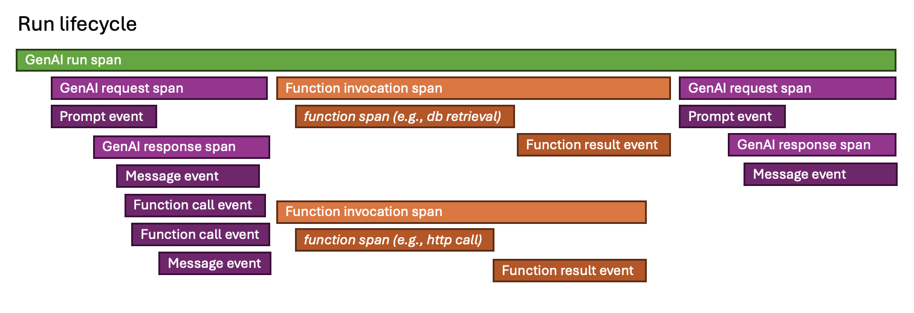

<!--- Hugo front matter used to generate the website version of this page:
linkTitle: Generative AI traces
--->

# Semantic Conventions for GenAI run operations

**Status**: [Experimental][DocumentStatus]

<!-- Re-generate TOC with `markdown-toc --no-first-h1 -i` -->

<!-- toc -->

- [Name](#name)
- [Configuration](#configuration)
- [GenAI attributes](#genai-attributes)
- [Events](#events)

<!-- tocstop -->

A run of a Generative AI (GenAI) model is modeled as a span in a trace with
sub-spans for request spans and function invocation spans.

**Span kind:** MAY be `CLIENT` or `SERVER`.

## Lifecycle of a GenAI run operation
The run lifecycle represents a multi-step operation that includes sending a prompt to a Generative AI model and completing the "function calling" loop by iteratively:
1. Requesting a completion from the model
2. Streaming in the responses from the model (chat messages or tool calls)
3. Performing any function calls based on the completion
4. Sending the results of the function calls back to the model as a new prompt
5. Repeating the process until the model returns a finished completion or the operation is otherwise cancelled.

> [!NOTE] A model can return multiple chat messages within the "function calling" loop. Each message is considered a separate completion.

This cycle results in the following span structure:
- **Run span**: Represents the entire lifecycle of a GenAI run operation.
  - **Request span**: Represents the prompt sent to the model.
    - **Prompt event**: Represents a single prompt sent to the model.
    - **Response span**: Represents the completion received from the model.
        - **Message event**: Represents a single message received from the model.
        - **Tool call event**: Represents a tool call received from the model.
  - **Function invocation span**: Represents the function call made based on the completion.
    - **Function result event**: Represents the prompt sent to the model based on the completion.

The following diagram illustrates the lifecycle of a GenAI run operation:

## Name

GenAI spans MUST follow the overall [guidelines for span names](https://github.com/open-telemetry/opentelemetry-specification/tree/v1.35.0/specification/trace/api.md#span).
The **span name** SHOULD be `{gen_ai.operation.name} {gen_ai.request.model}`.
Semantic conventions for individual GenAI systems and frameworks MAY specify different span name format.

## Configuration

Instrumentations for Generative AI clients MAY capture prompts, completions, and function results.
Instrumentations that support it, MUST offer the ability to turn off capture of prompts, completions, tool call attributes, and tool invocation responses. This is for three primary reasons:

1. Data privacy concerns. End users of GenAI applications may input sensitive information or personally identifiable information (PII) that they do not wish to be sent to a telemetry backend.
2. Data size concerns. Although there is no specified limit to sizes, there are practical limitations in programming languages and telemetry systems. Some GenAI systems allow for extremely large context windows that end users may take full advantage of.
3. Performance concerns. Sending large amounts of data to a telemetry backend may cause performance issues for the application.

## GenAI run span
The run span represents the entire lifecycle of a GenAI run operation. It starts when the initial prompt is sent to the model and ends when the operation is completed or cancelled.

### GenAI run span attributes

| Attribute  | Type | Description  | Examples  | [Requirement Level](https://opentelemetry.io/docs/specs/semconv/general/attribute-requirement-level/) | Stability |
|---|---|---|---|---|---|
| [`gen_ai.operation.name`](/docs/attributes-registry/gen-ai.md) | string | The name of the operation being performed. It is always `run` | `run` | `Required` |  |
| [`gen_ai.system`](/docs/attributes-registry/gen-ai.md) | string | The Generative AI product as identified by the client or server instrumentation. A run _may_ consist of calls to multiple GenAI systems, so this is optional | `openai` | `Recommended` |  |
| [`error.type`](/docs/attributes-registry/error.md) | string | Describes a class of error the operation ended with.| `timeout`; `java.net.UnknownHostException`; `server_certificate_invalid`; `500` | `Conditionally Required` if the operation ended in an error |  |
| [`server.port`](/docs/attributes-registry/server.md) | int | GenAI server port. | `80`; `8080`; `443` | `Conditionally Required` If `server.address` is set. |  |
| [`server.address`](/docs/attributes-registry/server.md) | string | GenAI server address. | `example.com`; `10.1.2.80`; `/tmp/my.sock` | `Recommended` |  |

## GenAI request span
The GenAI request span should track input data and metadata for a request to an GenAI model. Each attribute with the span represents a concept that is common to most Generative AI clients.

## GenAI request span attributes

<!-- semconv trace.gen_ai.client -->
<!-- NOTE: THIS TEXT IS AUTOGENERATED. DO NOT EDIT BY HAND. -->
<!-- see templates/registry/markdown/snippet.md.j2 -->
<!-- prettier-ignore-start -->
<!-- markdownlint-capture -->
<!-- markdownlint-disable -->

| Attribute  | Type | Description  | Examples  | [Requirement Level](https://opentelemetry.io/docs/specs/semconv/general/attribute-requirement-level/) | Stability |
|---|---|---|---|---|---|
| [`gen_ai.operation.name`](/docs/attributes-registry/gen-ai.md) | string | The name of the operation being performed. [1] | `chat`; `text_completion` | `Required` |  |
| [`gen_ai.request.model`](/docs/attributes-registry/gen-ai.md) | string | The name of the GenAI model a request is being made to. [2] | `gpt-4` | `Required` |  |
| [`gen_ai.system`](/docs/attributes-registry/gen-ai.md) | string | The Generative AI product as identified by the client or server instrumentation. [3] | `openai` | `Required` |  |
| [`error.type`](/docs/attributes-registry/error.md) | string | Describes a class of error the operation ended with. [4] | `timeout`; `java.net.UnknownHostException`; `server_certificate_invalid`; `500` | `Conditionally Required` if the operation ended in an error |  |
| [`server.port`](/docs/attributes-registry/server.md) | int | GenAI server port. [5] | `80`; `8080`; `443` | `Conditionally Required` If `server.address` is set. |  |
| [`gen_ai.request.frequency_penalty`](/docs/attributes-registry/gen-ai.md) | double | The frequency penalty setting for the GenAI request. | `0.1` | `Recommended` |  |
| [`gen_ai.request.max_tokens`](/docs/attributes-registry/gen-ai.md) | int | The maximum number of tokens the model generates for a request. | `100` | `Recommended` |  |
| [`gen_ai.request.presence_penalty`](/docs/attributes-registry/gen-ai.md) | double | The presence penalty setting for the GenAI request. | `0.1` | `Recommended` |  |
| [`gen_ai.request.stop_sequences`](/docs/attributes-registry/gen-ai.md) | string[] | List of sequences that the model will use to stop generating further tokens. | `["forest", "lived"]` | `Recommended` |  |
| [`gen_ai.request.temperature`](/docs/attributes-registry/gen-ai.md) | double | The temperature setting for the GenAI request. | `0.0` | `Recommended` |  |
| [`gen_ai.request.top_k`](/docs/attributes-registry/gen-ai.md) | double | The top_k sampling setting for the GenAI request. | `1.0` | `Recommended` |  |
| [`gen_ai.request.top_p`](/docs/attributes-registry/gen-ai.md) | double | The top_p sampling setting for the GenAI request. | `1.0` | `Recommended` |  |
| [`gen_ai.response.finish_reasons`](/docs/attributes-registry/gen-ai.md) | string[] | Array of reasons the model stopped generating tokens, corresponding to each generation received. | `["stop"]`; `["stop", "length"]` | `Recommended` |  |
| [`gen_ai.usage.input_tokens`](/docs/attributes-registry/gen-ai.md) | int | The number of tokens used in the GenAI input (prompt). | `100` | `Recommended` |  |
| [`gen_ai.usage.output_tokens`](/docs/attributes-registry/gen-ai.md) | int | The number of tokens used in the GenAI response (completion). | `180` | `Recommended` |  |
| [`server.address`](/docs/attributes-registry/server.md) | string | GenAI server address. [7] | `example.com`; `10.1.2.80`; `/tmp/my.sock` | `Recommended` |  |

**[1]:** If one of the predefined values applies, but specific system uses a different name it's RECOMMENDED to document it in the semantic conventions for specific GenAI system and use system-specific name in the instrumentation. If a different name is not documented, instrumentation libraries SHOULD use applicable predefined value.

**[2]:** The name of the GenAI model a request is being made to. If the model is supplied by a vendor, then the value must be the exact name of the model requested. If the model is a fine-tuned custom model, the value should have a more specific name than the base model that's been fine-tuned.

**[3]:** The `gen_ai.system` describes a family of GenAI models with specific model identified
by `gen_ai.request.model` and `gen_ai.response.model` attributes.

The actual GenAI product may differ from the one identified by the client.
For example, when using OpenAI client libraries to communicate with Mistral, the `gen_ai.system`
is set to `openai` based on the instrumentation's best knowledge.

For custom model, a custom friendly name SHOULD be used.
If none of these options apply, the `gen_ai.system` SHOULD be set to `_OTHER`.

**[4]:** The `error.type` SHOULD match the error code returned by the Generative AI provider or the client library,
the canonical name of exception that occurred, or another low-cardinality error identifier.
Instrumentations SHOULD document the list of errors they report.

**[5]:** When observed from the client side, and when communicating through an intermediary, `server.port` SHOULD represent the server port behind any intermediaries, for example proxies, if it's available.

**[6]:** If available. The name of the GenAI model that provided the response. If the model is supplied by a vendor, then the value must be the exact name of the model actually used. If the model is a fine-tuned custom model, the value should have a more specific name than the base model that's been fine-tuned.

**[7]:** When observed from the client side, and when communicating through an intermediary, `server.address` SHOULD represent the server address behind any intermediaries, for example proxies, if it's available.

`error.type` has the following list of well-known values. If one of them applies, then the respective value MUST be used; otherwise, a custom value MAY be used.

| Value  | Description | Stability |
|---|---|---|
| `_OTHER` | A fallback error value to be used when the instrumentation doesn't define a custom value. |  |

`gen_ai.operation.name` has the following list of well-known values. If one of them applies, then the respective value MUST be used; otherwise, a custom value MAY be used.

| Value  | Description | Stability |
|---|---|---|
| `chat` | Chat completion operation such as [OpenAI Chat API](https://platform.openai.com/docs/api-reference/chat) |  |
| `text_completion` | Text completions operation such as [OpenAI Completions API (Legacy)](https://platform.openai.com/docs/api-reference/completions) |  |

`gen_ai.system` has the following list of well-known values. If one of them applies, then the respective value MUST be used; otherwise, a custom value MAY be used.

| Value  | Description | Stability |
|---|---|---|
| `anthropic` | Anthropic |  |
| `cohere` | Cohere |  |
| `openai` | OpenAI |  |
| `vertex_ai` | Vertex AI |  |

<!-- markdownlint-restore -->
<!-- prettier-ignore-end -->
<!-- END AUTOGENERATED TEXT -->
<!-- endsemconv -->

### GenAI request span events

In the lifetime of a GenAI request span, an event for prompts sent and completions received (i.e., messages and tool calls)  MAY be created, depending on the configuration of the instrumentation.

To support streaming scenarios, the events for completion events SHOULD be created as soon as a complete message or tool call is received from the GenAI model.

<!-- semconv gen_ai.content.prompt -->
<!-- NOTE: THIS TEXT IS AUTOGENERATED. DO NOT EDIT BY HAND. -->
<!-- see templates/registry/markdown/snippet.md.j2 -->
<!-- prettier-ignore-start -->
<!-- markdownlint-capture -->
<!-- markdownlint-disable -->

The event name MUST be `gen_ai.content.prompt`.

| Attribute  | Type | Description  | Examples  | [Requirement Level](https://opentelemetry.io/docs/specs/semconv/general/attribute-requirement-level/) | Stability |
|---|---|---|---|---|---|
| [`gen_ai.prompt`](/docs/attributes-registry/gen-ai.md) | string | The full prompt sent to the GenAI model. [1] | `[{'role': 'user', 'content': 'What is the capital of France?'}]` | `Conditionally Required` if and only if corresponding event is enabled |  |

**[1]:** It's RECOMMENDED to format prompts as JSON string matching [OpenAI messages format](https://platform.openai.com/docs/guides/text-generation)

## GenAI response span
The GenAI response span should track the completions received from a GenAI model. Each attribute with the span represents a concept that is common to most Generative AI clients.

### GenAI response span attributes

<!-- semconv trace.gen_ai.client -->
<!-- NOTE: THIS TEXT IS AUTOGENERATED. DO NOT EDIT BY HAND. -->
<!-- see templates/registry/markdown/snippet.md.j2 -->
<!-- prettier-ignore-start -->
<!-- markdownlint-capture -->
<!-- markdownlint-disable -->

| Attribute  | Type | Description  | Examples  | [Requirement Level](https://opentelemetry.io/docs/specs/semconv/general/attribute-requirement-level/) | Stability |
|---|---|---|---|---|---|
| [`gen_ai.operation.name`](/docs/attributes-registry/gen-ai.md) | string | The name of the operation being performed. [1] | `response` | `Required` |  |
| [`gen_ai.system`](/docs/attributes-registry/gen-ai.md) | string | The Generative AI product as identified by the client or server instrumentation. [3] | `openai` | `Required` |  |
| [`error.type`](/docs/attributes-registry/error.md) | string | Describes a class of error the operation ended with. [4] | `timeout`; `java.net.UnknownHostException`; `server_certificate_invalid`; `500` | `Conditionally Required` if the operation ended in an error |  |
| [`server.port`](/docs/attributes-registry/server.md) | int | GenAI server port. [5] | `80`; `8080`; `443` | `Conditionally Required` If `server.address` is set. |  |
| [`gen_ai.response.finish_reasons`](/docs/attributes-registry/gen-ai.md) | string[] | Array of reasons the model stopped generating tokens, corresponding to each generation received. | `["stop"]`; `["stop", "length"]` | `Recommended` |  |
| [`gen_ai.response.id`](/docs/attributes-registry/gen-ai.md) | string | The unique identifier for the completion. | `chatcmpl-123` | `Recommended` |  |
| [`gen_ai.response.model`](/docs/attributes-registry/gen-ai.md) | string | The name of the model that generated the response. [6] | `gpt-4-0613` | `Recommended` |  |
| [`server.address`](/docs/attributes-registry/server.md) | string | GenAI server address. [7] | `example.com`; `10.1.2.80`; `/tmp/my.sock` | `Recommended` |  |

### GenAI response span events

<!-- markdownlint-restore -->
<!-- prettier-ignore-end -->
<!-- END AUTOGENERATED TEXT -->
<!-- endsemconv -->

<!-- semconv gen_ai.content.completion -->
<!-- NOTE: THIS TEXT IS AUTOGENERATED. DO NOT EDIT BY HAND. -->
<!-- see templates/registry/markdown/snippet.md.j2 -->
<!-- prettier-ignore-start -->
<!-- markdownlint-capture -->
<!-- markdownlint-disable -->

The event name MUST be `gen_ai.content.message`.

| Attribute  | Type | Description  | Examples  | [Requirement Level](https://opentelemetry.io/docs/specs/semconv/general/attribute-requirement-level/) | Stability |
|---|---|---|---|---|---|
| [`gen_ai.completion`](/docs/attributes-registry/gen-ai.md) | string | A single completed message received from the GenAI model. [1] | `{'role': 'assistant', 'content': 'The capital of France is Paris.'}` | `Conditionally Required` if and only if corresponding event is enabled |

**[1]:** It's RECOMMENDED to format completions as JSON string matching [OpenAI messages format](https://platform.openai.com/docs/guides/text-generation)

The event name MUST be `gen_ai.content.tool_call`.

| Attribute  | Type | Description  | Examples  | [Requirement Level](https://opentelemetry.io/docs/specs/semconv/general/attribute-requirement-level/) | Stability |
|---|---|---|---|---|---|
| [`gen_ai.tool_call.id`](/docs/attributes-registry/gen-ai.md) | string | The id of the tool call so it can be correlated with a tool result. [6] | `cab85264-94b0-4ee3-9684-2e7d96c80f0c` | `Required` |  |
| [`gen_ai.tool_call.name`](/docs/attributes-registry/gen-ai.md) | string | The name of the tool that is being called. [6] | `get_weather` | `Conditionally Required` if and only if corresponding attribute is enabled |  |  |
| [`gen_ai.tool_call.arguments`](/docs/attributes-registry/gen-ai.md) | string | The parameters for the called tool. [6] | `{\n\"location\": \"Boston, MA\"\n}` | `Conditionally Required` if and only if corresponding attribute is enabled | |  |

<!-- markdownlint-restore -->
<!-- prettier-ignore-end -->
<!-- END AUTOGENERATED TEXT -->
<!-- endsemconv -->

[DocumentStatus]: https://github.com/open-telemetry/opentelemetry-specification/tree/v1.22.0/specification/document-status.md

## Tool invocation span
If a tool call is requested by the model, a tool result span should be created to represent the result of the tool call. The tool result span is nested within the run span and happens sequentially after the chat completion.

### Tool invocation span attributes

| Attribute  | Type | Description  | Examples  | [Requirement Level](https://opentelemetry.io/docs/specs/semconv/general/attribute-requirement-level/) | Stability |
|---|---|---|---|---|---|
| [`gen_ai.operation.name`](/docs/attributes-registry/gen-ai.md) | string | The name of the operation being performed. It is always `tool_invocation` | `tool_invocation` | `Required` |  |
| [`error.type`](/docs/attributes-registry/error.md) | string | Describes a class of error the operation ended with. [4] | `timeout`; `java.net.UnknownHostException`; `server_certificate_invalid`; `500` | `Conditionally Required` if the operation ended in an error |  |
| [`gen_ai.request.tool.id`](/docs/attributes-registry/gen-ai.md) | string | The id of the tool invocation so it can be correlated with the tool call. [6] | `cab85264-94b0-4ee3-9684-2e7d96c80f0c` | `Required` |  | `Recommended` |  |

> [!Note] Nested within the tool result span should be any events that are generated by the tool invocation. These events should follow general OpenTelemetry semantic conventions.

### Tool invocation span events

In the lifetime of a tool result span, an event for the result, depending on the configuration of the instrumentation.

The event name MUST be `gen_ai.content.tool_result`.

| Attribute  | Type | Description  | Examples  | [Requirement Level](https://opentelemetry.io/docs/specs/semconv/general/attribute-requirement-level/) | Stability |
|---|---|---|---|---|---|
| [`gen_ai.tool_result`](/docs/attributes-registry/gen-ai.md) | string | The name of the tool that is being called. [6] | `{"temperature": "72F"}` | `Conditionally Required` if and only if corresponding event is enabled |  |
