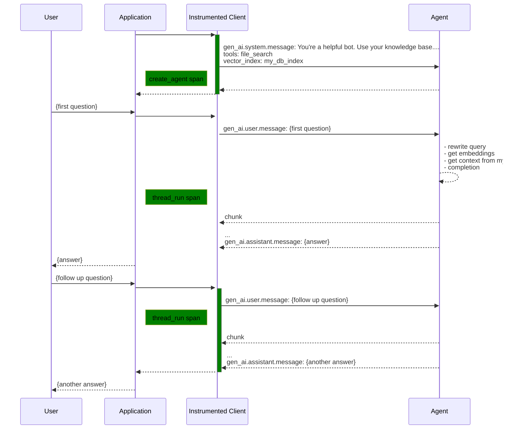

<!--- Hugo front matter used to generate the website version of this page:
linkTitle: Generative AI traces
--->

# Semantic Conventions for GenAI spans

**Status**: [Experimental][DocumentStatus]

<!-- Re-generate TOC with `markdown-toc --no-first-h1 -i` -->

<!-- toc -->

- [Name](#name)
- [GenAI attributes](#genai-attributes)
- [Capturing inputs and outputs](#capturing-inputs-and-outputs)

<!-- tocstop -->

A request to an Generative AI is modeled as a span in a trace.

**Span kind:** MUST always be `CLIENT`.

## Name

GenAI spans MUST follow the overall [guidelines for span names](https://github.com/open-telemetry/opentelemetry-specification/tree/v1.37.0/specification/trace/api.md#span).
The **span name** SHOULD be `{gen_ai.operation.name} {gen_ai.request.model}`.
Semantic conventions for individual GenAI systems and frameworks MAY specify different span name format.

## GenAI attributes

These attributes track input data and metadata for a request to an GenAI model. Each attribute represents a concept that is common to most Generative AI clients.

<!-- semconv trace.gen_ai.client.span -->
<!-- NOTE: THIS TEXT IS AUTOGENERATED. DO NOT EDIT BY HAND. -->
<!-- see templates/registry/markdown/snippet.md.j2 -->
<!-- prettier-ignore-start -->
<!-- markdownlint-capture -->
<!-- markdownlint-disable -->

| Attribute  | Type | Description  | Examples  | [Requirement Level](https://opentelemetry.io/docs/specs/semconv/general/attribute-requirement-level/) | Stability |
|---|---|---|---|---|---|
| [`gen_ai.operation.name`](/docs/attributes-registry/gen-ai.md) | string | The name of the operation being performed. [1] | `chat`; `create_thread_run`; `thread_run` | `Required` |  |
| [`gen_ai.system`](/docs/attributes-registry/gen-ai.md) | string | The Generative AI product as identified by the client or server instrumentation. [2] | `openai` | `Required` |  |
| [`error.type`](/docs/attributes-registry/error.md) | string | Describes a class of error the operation ended with. [3] | `timeout`; `java.net.UnknownHostException`; `server_certificate_invalid`; `500` | `Conditionally Required` if the operation ended in an error |  |
| [`gen_ai.request.model`](/docs/attributes-registry/gen-ai.md) | string | The name of the GenAI model a request is being made to. [4] | `gpt-4` | `Conditionally Required` If available. |  |
| [`server.port`](/docs/attributes-registry/server.md) | int | GenAI server port. [5] | `80`; `8080`; `443` | `Conditionally Required` If `server.address` is set. |  |
| [`gen_ai.request.frequency_penalty`](/docs/attributes-registry/gen-ai.md) | double | The frequency penalty setting for the GenAI request. | `0.1` | `Recommended` |  |
| [`gen_ai.request.max_input_tokens`](/docs/attributes-registry/gen-ai.md) | int | The maximum number of prompt tokens the model can use. | `100` | `Recommended` |  |
| [`gen_ai.request.max_output_tokens`](/docs/attributes-registry/gen-ai.md) | int | The maximum number of completion tokens the model generates in response. | `100` | `Recommended` |  |
| [`gen_ai.request.presence_penalty`](/docs/attributes-registry/gen-ai.md) | double | The presence penalty setting for the GenAI request. | `0.1` | `Recommended` |  |
| [`gen_ai.request.stop_sequences`](/docs/attributes-registry/gen-ai.md) | string[] | List of sequences that the model will use to stop generating further tokens. | `["forest", "lived"]` | `Recommended` |  |
| [`gen_ai.request.temperature`](/docs/attributes-registry/gen-ai.md) | double | The temperature setting for the GenAI request. | `0.0` | `Recommended` |  |
| [`gen_ai.request.top_k`](/docs/attributes-registry/gen-ai.md) | double | The top_k sampling setting for the GenAI request. | `1.0` | `Recommended` |  |
| [`gen_ai.request.top_p`](/docs/attributes-registry/gen-ai.md) | double | The top_p sampling setting for the GenAI request. | `1.0` | `Recommended` |  |
| [`gen_ai.response.finish_reasons`](/docs/attributes-registry/gen-ai.md) | string[] | Array of reasons the model stopped generating tokens, corresponding to each generation received. | `["stop"]`; `["stop", "length"]` | `Recommended` |  |
| [`gen_ai.response.id`](/docs/attributes-registry/gen-ai.md) | string | The unique identifier for the completion. | `chatcmpl-123` | `Recommended` |  |
| [`gen_ai.response.model`](/docs/attributes-registry/gen-ai.md) | string | The name of the model that generated the response. [6] | `gpt-4-0613` | `Recommended` |  |
| [`gen_ai.usage.input_tokens`](/docs/attributes-registry/gen-ai.md) | int | The number of tokens used in the GenAI input (prompt). | `100` | `Recommended` |  |
| [`gen_ai.usage.output_tokens`](/docs/attributes-registry/gen-ai.md) | int | The number of tokens used in the GenAI response (completion). | `180` | `Recommended` |  |
| [`server.address`](/docs/attributes-registry/server.md) | string | GenAI server address. [7] | `example.com`; `10.1.2.80`; `/tmp/my.sock` | `Recommended` |  |

**[1]:** If one of the predefined values applies, but specific system uses a different name it's RECOMMENDED to document it in the semantic conventions for specific GenAI system and use system-specific name in the instrumentation. If a different name is not documented, instrumentation libraries SHOULD use applicable predefined value.

**[2]:** The `gen_ai.system` describes a family of GenAI models with specific model identified
by `gen_ai.request.model` and `gen_ai.response.model` attributes.

The actual GenAI product may differ from the one identified by the client.
For example, when using OpenAI client libraries to communicate with Mistral, the `gen_ai.system`
is set to `openai` based on the instrumentation's best knowledge.

For custom model, a custom friendly name SHOULD be used.
If none of these options apply, the `gen_ai.system` SHOULD be set to `_OTHER`.

**[3]:** The `error.type` SHOULD match the error code returned by the Generative AI provider or the client library,
the canonical name of exception that occurred, or another low-cardinality error identifier.
Instrumentations SHOULD document the list of errors they report.

**[4]:** The name of the GenAI model a request is being made to. If the model is supplied by a vendor, then the value must be the exact name of the model requested. If the model is a fine-tuned custom model, the value should have a more specific name than the base model that's been fine-tuned.

**[5]:** When observed from the client side, and when communicating through an intermediary, `server.port` SHOULD represent the server port behind any intermediaries, for example proxies, if it's available.

**[6]:** If available. The name of the GenAI model that provided the response. If the model is supplied by a vendor, then the value must be the exact name of the model actually used. If the model is a fine-tuned custom model, the value should have a more specific name than the base model that's been fine-tuned.

**[7]:** When observed from the client side, and when communicating through an intermediary, `server.address` SHOULD represent the server address behind any intermediaries, for example proxies, if it's available.

`error.type` has the following list of well-known values. If one of them applies, then the respective value MUST be used; otherwise, a custom value MAY be used.

| Value  | Description | Stability |
|---|---|---|
| `_OTHER` | A fallback error value to be used when the instrumentation doesn't define a custom value. |  |

`gen_ai.operation.name` has the following list of well-known values. If one of them applies, then the respective value MUST be used; otherwise, a custom value MAY be used.

| Value  | Description | Stability |
|---|---|---|
| `chat` | Chat completion operation such as [OpenAI Chat API](https://platform.openai.com/docs/api-reference/chat) |  |
| `create_thread_run` | Create a run on a thread [8] |  |
| `execute_tool` | Execute a tool |  |
| `submit_tool_output` | Submit tool call results to a run |  |
| `text_completion` | Text completions operation such as [OpenAI Completions API (Legacy)](https://platform.openai.com/docs/api-reference/completions) |  |
| `thread_run` | Run a thread on an agent [9] |  |

**[8]:** This operation describes creating a run. The run can consist of multiple steps (such as GenAI chat calls) which may be executed locally on the the client by a GenAI client framework or remotely on the GenAI agent.
Unlike `run` this operation covers the creation of the thread run and does not include time awaiting the completion of the run.
Instrumentations SHOULD report `run` operation instead of `create_run` whenever possible.

**[9]:** This operation describes creating and processing a thread run on an agent.
The run can consist of multiple steps (such as GenAI chat calls) which may be executed locally on the the client by a GenAI client framework or remotely on the GenAI agent.
The instrumented operation SHOULD cover full duration of the run including time awaiting the final completion. It SHOULD be reported for streaming runs, or for operations that involve polling the status.

`gen_ai.system` has the following list of well-known values. If one of them applies, then the respective value MUST be used; otherwise, a custom value MAY be used.

| Value  | Description | Stability |
|---|---|---|
| `anthropic` | Anthropic |  |
| `az.ai.inference` | Azure AI Inference |  |
| `cohere` | Cohere |  |
| `openai` | OpenAI |  |
| `vertex_ai` | Vertex AI |  |

<!-- markdownlint-restore -->
<!-- prettier-ignore-end -->
<!-- END AUTOGENERATED TEXT -->
<!-- endsemconv -->

## Capturing inputs and outputs

User inputs and model responses may be recorded as events parented to GenAI operation span. See [Semantic Conventions for GenAI events](./gen-ai-events.md) for the details.

## AI agents

Generative AI applications use patterns like
[RAG](https://wikipedia.org/wiki/Retrieval-augmented_generation) that involve
multiple operations such as GenAI or database calls. They also may need to store
conversation history which also involves communication with multiple services.

These features could be implemented in the application code, client framework
such as [LangChain](https://python.langchain.com/v0.1/docs/modules/agents/agent_types)
or on the managed service such as [OpenAI Assistants](https://platform.openai.com/docs/assistants),
[Azure AI Agents](TODO link), or [Amazon Bedrock Agents](https://aws.amazon.com/bedrock/agents/).

This section covers semantic conventions for agent operations and is intended for
GenAI client frameworks or libraries.

### Agent spans

Agent spans share the same set of [attributes](#genai-attributes) as other GenAI spans.
Let's list common agent operations and corresponding properties.

- **create_agent** - describes the process of creating an agent. The agent is usually
   shared across multiple thread runs.
- **create_thread** - describes creation of a thread (also known as session or conversation)
  that may contain multiple messages.
- **thread_run** - describes a thread run during which an agent processes messages in the
  thread and generates a next message. The `thread_run` span SHOULD cover the full duration of
  the run.
- **submit_tool_output** - describes the process of submitting tool responses to the agent.
- **execute_tool** - describes client-side tool execution. Instrumentation SHOULD
  capture corresponding spans when it is possible.

If GenAI framework uses model-specific client library to communicate with the model,
the framework instrumentation SHOULD NOT instrument the underlying client library **by default**.
It MAY, however, provide the instrumentation for underlying library as an opt-in feature.

#### AI Agent example

```mermaid
%%{init:
{
  "sequence": { "messageAlign": "left", "htmlLabels":true },
  "themeVariables": { "noteBkgColor" : "green", "noteTextColor": "black", "activationBkgColor": "green", "htmlLabels":true }
}
}%%
sequenceDiagram
    participant U as User
    participant A as Application
    participant I as Instrumented Client
    participant M as Agent
    A->>+I: #U+200D
    I->>M: gen_ai.system.message: You're a helpful bot. Use your knowledge base....<br/>tools: file_search<br/>vector_index: my_db_index
    Note left of I: create_agent span
    M-->>I: #U+200D
    I-->>-A: #U+200D

    U->>A: {first question}
    A->>+I: #U+200D

    I->>M: gen_ai.user.message: {first question}
    M-->>M: - rewrite query<br/>- get embeddings<br/>- get context from my_db_index<br/>- completion
    Note left of I: thread_run span
    M-->>I: chunk
    M-->>I: ...<br/>gen_ai.assistant.message: {answer}
    A-->>U: {answer}

    U->>A: {follow up question}
    A->>+I: #U+200D

    I->>M: gen_ai.user.message: {follow up question}

    Note left of I: thread_run span
    M-->>I: chunk
    M-->>I: ...<br/>gen_ai.assistant.message: {another answer}
    I-->>-A: #U+200D
    A -->>U: {another answer}
```

[DocumentStatus]: https://opentelemetry.io/docs/specs/otel/document-status